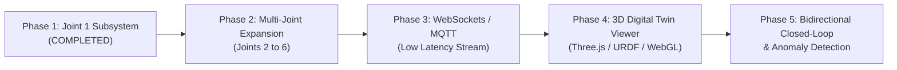

# Capstone Project Update: Robotic Arm Digital Twin
**Joint 1 Telemetry Subsystem (ESP32-C6 + AS5600 Magnetic Encoder)**

---

## 1. Executive Summary

This update details the development, integration, and milestone progress for the **Robotic Arm Digital Twin** capstone project. The primary objective is to create a high-fidelity cyber-physical bridge between a physical multi-axis robotic arm and its real-time 3D digital twin.

The initial milestone—**Joint 1 (Base Rotation / NEMA 17 Stepper Motor) Angular Telemetry Subsystem**—is complete. It features an ultra-compact **ESP32-C6 Super Mini** microcontroller paired with an **AS5600 12-bit Magnetic Rotary Encoder**, delivering 0.087° resolution wireless angle tracking, zero-calibration, live web visualization, and RESTful telemetry APIs.

```
+-----------------------------------------------------------------------------------+
|                            PHYSICAL ROBOTIC ARM                                   |
|                                                                                   |
|  [ NEMA 17 Motor ] === [ Diametric Magnet ]                                       |
|                               | (0.5 - 1.5mm air gap)                             |
|                               v                                                   |
|                      [ AS5600 12-Bit Encoder ]                                    |
|                               |                                                   |
|                               | I2C (SDA: GPIO 6, SCL: GPIO 7)                    |
|                               v                                                   |
|                   [ ESP32-C6 Super Mini MCU ]                                     |
+-------------------------------|---------------------------------------------------+
                                | Wi-Fi 6 / 802.11 b/g/n (mDNS: joint1.local)
                                v
+-----------------------------------------------------------------------------------+
|                        CYBER / DIGITAL TWIN LAYER                                 |
|                                                                                   |
|  +------------------------+  +------------------------+  +---------------------+  |
|  |   Built-in Dark Web    |  |   Python Data Stream   |  |   3D Digital Twin   |  |
|  | Dashboard (HTTP Port80)|  |   Client / ROS Bridge  |  | (Three.js/Isaac/Web)|  |
|  +------------------------+  +------------------------+  +---------------------+  |
+-----------------------------------------------------------------------------------+
```

---

## 2. Key Accomplishments & Deliverables

### A. Embedded Firmware Architecture
- **Dedicated Driver Layer (`AS5600_Driver.h`)**:
  - Implemented direct I2C communication without external heavy library dependencies.
  - 12-bit raw angle acquisition ($4096 \text{ counts/revolution} \rightarrow 0.08789^\circ / \text{step}$).
  - Automatic **cumulative angle unwrapping** to track multi-turn continuous rotation ($-\infty^\circ$ to $+\infty^\circ$).
  - Real-time magnet diagnostic monitoring: **AGC (Automatic Gain Control)** register reading (0–255), Magnet Detect (`MD`), Magnet Too Strong (`ML`), and Magnet Too Weak (`MH`) flags.
  - Software zero-point calibration and offset retention.

- **Non-Blocking Telemetry & Web Server (`Joint1_ESP32C6_AS5600.ino`)**:
  - Embedded HTTP web server running on port `80`.
  - Full **CORS support** (`Access-Control-Allow-Origin: *`) allowing zero-friction communication with browser-based WebGL/Three.js digital twins.
  - Zero-calibration endpoint (`POST /api/zero`) for physical alignment.
  - Local hostname resolution via **mDNS** (`http://joint1.local`).

- **Over-The-Air (OTA) Updates (`ArduinoOTA`)**:
  - Integrated wireless firmware flashing capability. Developers can reflash firmware updates over Wi-Fi without physically connecting USB cables to the robotic arm joints.

### B. Visual Telemetry Dashboard (`web_dashboard.h`)
- Developed a self-contained, responsive, dark-mode web dashboard served directly from ESP32-C6 flash memory (`PROGMEM`).
- **Features**:
  - Real-time SVG circular dial gauge with dynamic angle needle and glow effects.
  - Dual readouts: Single-turn angle ($0.00^\circ - 359.99^\circ$) and Multi-turn cumulative angle.
  - Hardware health panel showing Raw 12-bit Ticks, I2C Bus Status, Wi-Fi RSSI Signal Strength, and Magnet Alignment health.
  - One-click **"Zero Position"** calibration button.
  - Real-time telemetry sparkline/graphing update loop at 20 Hz (50 ms interval).

### C. Python Telemetry & Digital Twin Bridge (`read_joint1.py`)
- Created a standalone Python polling client for integration with desktop pipelines, ROS (Robot Operating System), or custom physics simulation environments.
- Automatically handles reconnection and JSON parsing at configurable sample rates.

### D. Setup & Hardware Documentation (`PINOUT_AND_SETUP.md`)
- Documented full wiring schematics, pin mappings, magnet alignment guidelines (air gap, diametric vs axial magnetization), and dual-environment flashing instructions (PlatformIO & Arduino IDE).

---

## 3. Hardware Specifications & Pin Mapping

| Component | Specification / Setting | Notes |
| :--- | :--- | :--- |
| **Microcontroller** | ESP32-C6 Super Mini | 32-bit RISC-V @ 160 MHz, Wi-Fi 6 (2.4 GHz) |
| **Sensor** | AS5600 Magnetic Rotary Encoder | 12-Bit Resolution (4096 CPR / 0.087°) |
| **Motor Target** | NEMA 17 Stepper Motor | Joint 1 (Base Azimuth Rotation) |
| **I2C SDA** | **GPIO 6** | Configured in `pinout.h` |
| **I2C SCL** | **GPIO 7** | Configured in `pinout.h` |
| **Sensor Power** | **3.3V** (ESP32 3V3 Pin) | *Do not apply 5V to AS5600 3.3V logic* |
| **Sensor Direction** | **GND** (DIR Pin) | Clockwise increases angular count |

---

## 4. API Specification & Endpoints

| Endpoint | Method | Response Type | Description |
| :--- | :---: | :--- | :--- |
| `/angle` | `GET` | `application/json` | Returns fast joint angle: `{"joint1": 142.35}` |
| `/api/joint1` | `GET` | `application/json` | Alias for `/angle` for multi-joint REST standard |
| `/status` | `GET` | `application/json` | Full diagnostic telemetry (angle, cumulative, raw ticks, AGC, magnet health, RSSI) |
| `/api/zero` | `POST` | `application/json` | Resets current physical position to $0.00^\circ$ |
| `/` | `GET` | `text/html` | Serves the interactive Dark-Mode Web Dashboard |

#### Sample `/status` Response Payload:
```json
{
  "joint1": 142.35,
  "cumulative": 502.35,
  "raw": 1619,
  "agc": 128,
  "magnet_detected": true,
  "magnet_weak": false,
  "magnet_strong": false,
  "rssi": -54,
  "status": "Optimal Magnet Alignment"
}
```

---

## 5. Current Project Status

- [x] Hardware component selection and pinout validation (ESP32-C6 + AS5600).
- [x] Custom low-level I2C AS5600 driver implementation.
- [x] Multi-turn cumulative angle tracking algorithm.
- [x] Magnet health & AGC diagnostic telemetry.
- [x] High-performance RESTful JSON HTTP endpoints with CORS support.
- [x] Embedded rich visual Web UI dashboard.
- [x] Over-The-Air (OTA) wireless flashing pipeline.
- [x] Python real-time streaming bridge.
- [x] Comprehensive setup and pinout documentation.

---

## 6. Next Steps & Development Roadmap



1. **Multi-Joint Hardware Node Replication (Joints 2 – 6)**:
   - Replicate the proven ESP32-C6 + AS5600 node architecture across the remaining robotic arm degrees of freedom (Shoulder, Elbow, Wrist Pitch, Wrist Roll, Gripper).
   - Configure unique hostnames (`joint2.local`, `joint3.local`, etc.) and IP assignments.

2. **Real-time Protocol Upgrade (WebSocket / MQTT)**:
   - Introduce a WebSocket or MQTT publishing channel alongside HTTP polling to achieve $>60\text{ Hz}$ update rates with sub-5ms latency for fluid 3D animations.

3. **3D Digital Twin Web Visualizer**:
   - Build a browser-based Three.js / WebGL application rendering the robot's URDF / 3D CAD model.
   - Synchronize mesh joint rotations directly from live telemetry feeds.

4. **Closed-Loop Control & Anomaly Detection**:
   - Compare commanded stepper motor step angles against physical AS5600 encoder feedback to detect missed steps, mechanical binding, or external collisions.
