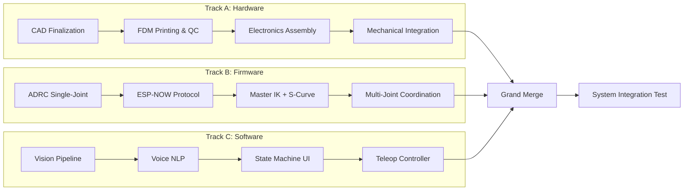
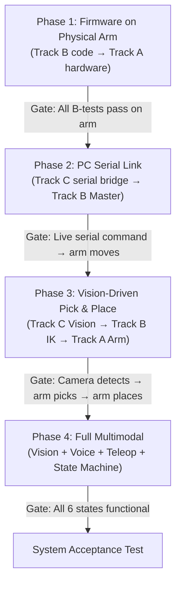

# Multimodal Cycloidal-Actuated Manipulator — Execution Plan

> **Project:** 3-DOF (provisioned 4-DOF) Multimodal Cycloidal-Actuated Manipulator  
> **Date:** 2026-05-26  
> **Status:** DESIGN → PROTOTYPE transition

---

## 1. Parallel Development Architecture

Three tracks execute concurrently. Isolation is enforced by **Interface Contracts** — strict, versioned data schemas that decouple tracks at compile/run time.

### Track Topology



### Interface Contracts (Cross-Track APIs)

These contracts allow all three tracks to develop against stable interfaces **without waiting on each other**.

#### Contract 1: ESP-NOW Packet Schema (Track B ↔ Track B internal, Track C → Track B)

```c
// master_to_node_payload.h — v1.0
typedef struct {
    uint8_t  joint_id;          // 0=Base, 1=Shoulder, 2=Elbow
    float    target_angle_deg;  // Target position in degrees
    float    velocity_limit;    // deg/s
    float    acceleration;      // deg/s²
    uint32_t sequence_id;       // For packet ordering / loss detection
} MasterToNodePayload;

// node_to_master_payload.h — v1.0
typedef struct {
    uint8_t  joint_id;
    float    current_angle_deg; // AS5600 reading
    uint8_t  error_state;       // 0=OK, 1=STALL, 2=ENCODER_FAULT, 3=OVERTEMP
    uint32_t sequence_id;
} NodeToMasterPayload;
```

#### Contract 2: PC-to-Master Serial/TCP Schema (Track C → Track B)

```json
{
    "cmd": "MOVE_XYZ",
    "x": 120.5,
    "y": 80.0,
    "z": 45.0,
    "velocity": 30.0,
    "seq": 1001
}
```

```json
{
    "cmd": "MOVE_JOINTS",
    "joints": [45.0, -30.0, 60.0],
    "velocity": 25.0,
    "seq": 1002
}
```

#### Contract 3: Vision Pipeline Output Schema (Track C internal)

```python
# vision_output.py — v1.0
@dataclass
class DetectedObject:
    color: str              # "red", "blue", "green", "yellow"
    centroid_px: tuple      # (cx, cy) in pixel space
    position_mm: tuple      # (X, Y, Z) in robot-frame mm
    confidence: float       # 0.0 - 1.0
    timestamp: float        # time.time()

@dataclass
class VisionFrame:
    objects: list[DetectedObject]
    frame_id: int
    fps: float
```

### How Tracks Work in Parallel (Non-Blocking Rules)

| Track A (Hardware) | Track B (Firmware) | Track C (Software) |
|---|---|---|
| Design & print cycloidal gearboxes | Develop ADRC on breadboard + single stepper | Build Vision Pipeline with static test images |
| Assemble electronics on bench | Test ESP-NOW with 2x ESP32 dev boards | Build Voice NLP with mock coordinate dict |
| Wire full arm | Integrate multi-joint control | Build serial/TCP bridge to Master |
| **Does NOT need** firmware or software | **Does NOT need** physical arm (uses bench stepper) | **Does NOT need** ESP32 hardware (uses mock serial) |

---

## 2. Independent Testing & Merge Strategy

### 2.1 Isolated Test Protocols

#### Track A: Hardware Validation

| Test ID | Test | Pass Criteria | Tools |
|---|---|---|---|
| `A-MECH-01` | Cycloidal gear free-spin | < 0.5° backlash measured with dial indicator | Dial indicator, manual rotation |
| `A-MECH-02` | Gear load test | Hold 1.5× rated torque for 60s without skip | Spring scale, lever arm |
| `A-MECH-03` | AS5600 encoder validation | ±0.5° accuracy across 360° sweep | Arduino + Serial Monitor |
| `A-ELEC-01` | Buck converter regulation | 3.3V ±5% under 500mA load per node | Multimeter, dummy load |
| `A-ELEC-02` | Motor driver smoke test | Each stepper moves ±90° on bench via standalone Arduino sketch | Arduino UNO test jig |
| `A-INTEG-01` | Full arm mechanical assembly | All 3 joints move freely, no binding | Manual manipulation |

#### Track B: Firmware Validation

| Test ID | Test | Pass Criteria | Tools |
|---|---|---|---|
| `B-ADRC-01` | Single-joint step response | Settle to ±0.5° within 500ms, no overshoot > 5% | ESP32-C6 + stepper + encoder on bench |
| `B-ADRC-02` | Disturbance rejection | Apply hand-load mid-trajectory, returns within ±1° in 200ms | Manual perturbation test |
| `B-NOW-01` | ESP-NOW round-trip latency | < 5ms round-trip (Master → Node → Master) | Timestamp logging via Serial |
| `B-NOW-02` | ESP-NOW packet loss stress test | < 0.1% loss over 10,000 packets at 100Hz | Automated packet counter script |
| `B-IK-01` | IK solver unit test | Known (X,Y,Z) → (θ₁,θ₂,θ₃) matches analytical solution within ±0.1° | PlatformIO unit test framework |
| `B-SCURVE-01` | S-Curve profile validation | Position, velocity, acceleration profiles smooth (visual + numerical check) | Serial plotter / Python matplotlib |
| `B-MULTI-01` | 3-joint coordinated move | All 3 joints reach target within ±1° simultaneously | 3× bench steppers |

#### Track C: Software Validation

| Test ID | Test | Pass Criteria | Tools |
|---|---|---|---|
| `C-VIS-01` | Color detection accuracy | ≥95% correct classification on 50-image test set | Python test script + labeled dataset |
| `C-VIS-02` | Coordinate calibration | Pixel-to-mm mapping error < 3mm across workspace | Calibration grid photo + ground truth |
| `C-VIS-03` | Pipeline FPS | ≥15 FPS sustained on target laptop | `time.time()` profiling |
| `C-NLP-01` | Intent parsing accuracy | ≥90% correct on 30-sentence test corpus | Unit test with predefined sentences |
| `C-NLP-02` | End-to-end voice command | Spoken "pick up red" → correct coordinate output within 2s | Manual test with mic |
| `C-SER-01` | Serial mock test | Python sends JSON command → receives ACK from mock ESP32 | `pyserial` + loopback or software mock |

### 2.2 Mock Interfaces for Isolated Development

#### Mock ESP32 for Software Testing (Track C without Track B)

```python
# tests/mocks/mock_esp32_serial.py
"""
Simulates ESP32-S3 Master over serial.
Run this on a second serial port or use socat/com0com for virtual ports.
"""
import serial, json, time

ser = serial.Serial('COM_VIRTUAL', 115200)
while True:
    line = ser.readline().decode().strip()
    if line:
        cmd = json.loads(line)
        # Simulate ACK with fake joint angles
        response = {
            "status": "OK",
            "joints": [cmd.get("x", 0) * 0.5, cmd.get("y", 0) * 0.3, cmd.get("z", 0) * 0.2],
            "seq": cmd.get("seq", 0)
        }
        ser.write((json.dumps(response) + '\n').encode())
        time.sleep(0.05)
```

#### Mock Vision Data for Firmware Testing (Track B without Track C)

```python
# tests/mocks/mock_vision_sender.py
"""
Sends fake vision coordinates to ESP32-S3 Master via Serial.
Used to test IK + S-Curve without real camera.
"""
import serial, json, time

TARGETS = [
    {"cmd": "MOVE_XYZ", "x": 100, "y": 50, "z": 30, "velocity": 20, "seq": 1},
    {"cmd": "MOVE_XYZ", "x": 150, "y": -30, "z": 60, "velocity": 25, "seq": 2},
    {"cmd": "MOVE_XYZ", "x": 80, "y": 80, "z": 10, "velocity": 15, "seq": 3},
]

ser = serial.Serial('COM3', 115200)
for target in TARGETS:
    ser.write((json.dumps(target) + '\n').encode())
    time.sleep(3)  # Wait for arm to execute
```

### 2.3 Grand Merge Protocol

The Grand Merge executes in **4 strict phases**. Each phase has a gate — you cannot proceed until the gate passes.



#### Grand Merge Phase Details

**Phase 1: Firmware → Hardware Mount**
- [ ] Flash Node firmware to each ESP32-C6 installed in arm
- [ ] Re-run `B-ADRC-01` and `B-ADRC-02` **on the physical arm** (not bench)
- [ ] Re-tune ADRC parameters (b0, observer bandwidth) for real inertia
- [ ] Validate ESP-NOW in physical enclosure (antenna proximity effects)
- [ ] **Gate:** All 3 joints track step commands within spec on the physical arm

**Phase 2: PC-to-Master Serial Bridge**
- [ ] Connect laptop to ESP32-S3 via USB Serial
- [ ] Send `MOVE_JOINTS` JSON commands from Python script
- [ ] Verify arm moves to commanded joint angles
- [ ] Send `MOVE_XYZ` commands, verify IK produces correct physical motion
- [ ] **Gate:** Arbitrary XYZ targets reliably reached within ±5mm

**Phase 3: Vision-Driven Autonomy**
- [ ] Mount overhead camera, calibrate pixel-to-mm transform
- [ ] Run Vision Pipeline, verify detected coordinates on screen overlay
- [ ] Wire Vision output → Serial → Master IK → Arm motion
- [ ] Execute 10 pick-and-place cycles, measure success rate
- [ ] **Gate:** ≥80% pick-and-place success rate

**Phase 4: Full Multimodal Integration**
- [ ] Integrate Voice NLP → Vision coordinate lookup → execution
- [ ] Connect Teleop replica arm ESP-NOW stream
- [ ] Implement Teach/Repeat mode memory array
- [ ] Build state machine with rotary encoder UI for mode switching
- [ ] Wire Web App dashboard (optional enhancement)
- [ ] **Gate:** All 6 states from System State Machine table functional

---

## 3. Agent-Optimized GitHub & Version Control

### 3.1 Repository Directory Structure

```text
Multimodal-Cycloidal-Robot/
├── .github/
│   └── workflows/
│       └── firmware-ci.yml          # PlatformIO build check on push
├── .gitattributes                   # LFS tracking for CAD binaries
├── .gitignore
├── README.md
├── CONTRIBUTING.md
├── PROGRESS_STATE.md                # Agent handoff state file
├── LICENSE
│
├── Hardware/
│   ├── Mechanical_CAD/
│   │   ├── SolidWorks_Source/       # *.sldprt, *.sldasm (Git LFS)
│   │   └── Manufacturing_Exports/  # *.STEP, *.STL (Git LFS)
│   └── Electronics/
│       ├── Schematics/             # KiCad/PDF wiring diagrams
│       └── PCB_Gerbers/            # Manufacturing files (Git LFS)
│
├── Firmware/
│   ├── Master_ESP32S3/
│   │   ├── platformio.ini
│   │   ├── src/
│   │   │   ├── main.cpp
│   │   │   ├── ik_solver.cpp / .h
│   │   │   ├── s_curve.cpp / .h
│   │   │   ├── espnow_hub.cpp / .h
│   │   │   ├── serial_bridge.cpp / .h
│   │   │   └── state_machine.cpp / .h
│   │   ├── lib/                    # Shared libraries (contracts)
│   │   │   └── Contracts/
│   │   │       ├── master_to_node_payload.h
│   │   │       └── node_to_master_payload.h
│   │   └── test/
│   │       ├── test_ik_solver.cpp
│   │       └── test_s_curve.cpp
│   │
│   ├── Node_ESP32C6/
│   │   ├── platformio.ini
│   │   ├── src/
│   │   │   ├── main.cpp
│   │   │   ├── adrc_controller.cpp / .h
│   │   │   ├── as5600_driver.cpp / .h
│   │   │   ├── stepper_driver.cpp / .h
│   │   │   └── espnow_node.cpp / .h
│   │   ├── lib/
│   │   │   └── Contracts/          # Symlink or copy of shared contracts
│   │   └── test/
│   │       └── test_adrc.cpp
│   │
│   └── Teleop_Controller/
│       ├── platformio.ini
│       └── src/
│           └── main.cpp
│
├── Software/
│   ├── Vision_Pipeline/
│   │   ├── requirements.txt
│   │   ├── vision_main.py
│   │   ├── calibration.py
│   │   ├── color_detector.py
│   │   ├── coordinate_mapper.py
│   │   └── tests/
│   │       ├── test_color_detector.py
│   │       └── test_coordinate_mapper.py
│   │
│   ├── Voice_Integration/
│   │   ├── requirements.txt
│   │   ├── voice_main.py
│   │   ├── intent_parser.py
│   │   └── tests/
│   │       └── test_intent_parser.py
│   │
│   └── Serial_Bridge/
│       ├── bridge.py               # PC ↔ ESP32-S3 communication layer
│       └── tests/
│           └── test_bridge.py
│
├── Tests/
│   ├── mocks/
│   │   ├── mock_esp32_serial.py
│   │   └── mock_vision_sender.py
│   ├── integration/
│   │   └── test_vision_to_arm.py
│   └── test_matrix.md              # Human-readable test tracking
│
└── Documentation/
    ├── BOM.csv
    ├── Assembly_Instructions.md
    ├── ADRC_Tuning_Guide.md
    └── Calibration_Procedure.md
```

### 3.2 Git Branching Strategy

```mermaid
gitgraph
    commit id: "initial-setup"
    branch develop
    commit id: "repo-structure"
    
    branch feature/adrc-node
    commit id: "ADRC controller"
    commit id: "AS5600 driver"
    commit id: "B-ADRC-01 pass"
    
    checkout develop
    branch feature/espnow-protocol
    commit id: "ESP-NOW hub"
    commit id: "B-NOW-01 pass"
    
    checkout develop
    branch feature/ik-solver
    commit id: "IK implementation"
    commit id: "B-IK-01 pass"
    
    checkout develop
    branch feature/vision-pipeline
    commit id: "color detector"
    commit id: "coordinate mapper"
    commit id: "C-VIS-01 pass"
    
    checkout develop
    branch feature/voice-nlp
    commit id: "intent parser"
    commit id: "C-NLP-01 pass"
    
    checkout develop
    merge feature/adrc-node
    merge feature/espnow-protocol
    merge feature/ik-solver
    merge feature/vision-pipeline
    merge feature/voice-nlp
    
    branch integration/grand-merge
    commit id: "Phase 1: FW on HW"
    commit id: "Phase 2: Serial link"
    commit id: "Phase 3: Vision auto"
    commit id: "Phase 4: Full multimodal"
    
    checkout main
    merge integration/grand-merge tag: "v1.0-prototype"
```

**Branch naming convention:**

| Branch Pattern | Purpose | Example |
|---|---|---|
| `main` | Stable, tested releases only | — |
| `develop` | Integration branch for merged features | — |
| `feature/<track>-<name>` | Isolated feature work | `feature/adrc-node`, `feature/vision-pipeline` |
| `fix/<track>-<name>` | Bug fixes | `fix/firmware-encoder-drift` |
| `integration/<phase>` | Grand Merge phases | `integration/grand-merge` |
| `hardware/<component>` | CAD file updates | `hardware/cycloidal-v2` |

**Merge Rules:**
1. All merges to `develop` require passing the relevant isolated test suite
2. All merges use **squash merge** to keep history clean
3. Every merge commit message references the test IDs that passed (e.g., `"feat(adrc): single joint controller [B-ADRC-01 ✓, B-ADRC-02 ✓]"`)
4. `main` only receives merges from `integration/` branches after system acceptance test

### 3.3 CAD Binary Management with Git LFS

```gitattributes
# 3D CAD files
*.sldprt filter=lfs diff=lfs merge=lfs -text
*.sldasm filter=lfs diff=lfs merge=lfs -text
*.STEP filter=lfs diff=lfs merge=lfs -text
*.step filter=lfs diff=lfs merge=lfs -text
*.STL filter=lfs diff=lfs merge=lfs -text
*.stl filter=lfs diff=lfs merge=lfs -text

# Electronics
*.gbr filter=lfs diff=lfs merge=lfs -text
*.drl filter=lfs diff=lfs merge=lfs -text
*.kicad_pcb filter=lfs diff=lfs merge=lfs -text

# Images & media
*.jpg filter=lfs diff=lfs merge=lfs -text
*.png filter=lfs diff=lfs merge=lfs -text
*.mp4 filter=lfs diff=lfs merge=lfs -text
```

**CAD Versioning Protocol:**
- CAD files live on `hardware/*` branches
- Each CAD update commit includes a changelog entry in `Hardware/Mechanical_CAD/CHANGELOG.md`
- STEP exports are regenerated from SolidWorks source on every commit
- STL files include slicer settings in filename: `base_gear_0.2mm_20infill.stl`

---

## 4. Critical Path & Dependency Matrix

### 4.1 Critical Path (Longest Sequential Chain)

```
CAD Finalize → FDM Print (longest: Shoulder gearbox ~18hr)  
→ Assemble Arm → Flash Firmware on Physical Arm  
→ ADRC Re-tune on Real Inertia → Serial Bridge Test  
→ Camera Mount + Calibration → Vision Pick-and-Place  
→ Full Multimodal Integration
```

**Estimated critical path duration: 6–8 weeks** (assuming single printer, part-time effort)

### 4.2 Dependency Matrix

#### Track A: Hardware Dependencies

- `A-MECH-01` (Gear QC) → **No dependencies.** Can begin immediately.
- `A-MECH-02` (Load Test) → Requires: `A-MECH-01` pass.
- `A-ELEC-01` (Buck Converter) → **No dependencies.** Can begin immediately.
- `A-ELEC-02` (Motor Driver Test) → Requires: `A-ELEC-01` pass.
- `A-INTEG-01` (Full Assembly) → Requires: All `A-MECH-*` and `A-ELEC-*` pass.

#### Track B: Firmware Dependencies

- `B-ADRC-01` (Single Joint) → **No dependencies.** Uses bench stepper.
- `B-ADRC-02` (Disturbance Rejection) → Requires: `B-ADRC-01` pass.
- `B-NOW-01` (ESP-NOW Latency) → **No dependencies.** Uses 2x dev boards.
- `B-NOW-02` (Packet Loss) → Requires: `B-NOW-01` pass.
- `B-IK-01` (IK Solver) → **No dependencies.** Pure math, testable in unit tests.
- `B-SCURVE-01` (S-Curve) → **No dependencies.** Pure math.
- `B-MULTI-01` (Multi-Joint) → Requires: `B-ADRC-02` + `B-NOW-02` + `B-IK-01` + `B-SCURVE-01` all pass.

#### Track C: Software Dependencies

- `C-VIS-01` (Color Detection) → **No dependencies.** Uses static images.
- `C-VIS-02` (Coordinate Calibration) → Requires: Physical camera + calibration grid (Track A provides mount).
- `C-VIS-03` (FPS) → Requires: `C-VIS-01` pass.
- `C-NLP-01` (Intent Parsing) → **No dependencies.** Pure text processing.
- `C-NLP-02` (E2E Voice) → Requires: `C-NLP-01` + `C-VIS-01` (needs coordinate dict).
- `C-SER-01` (Serial Mock) → **No dependencies.** Uses virtual serial port.

#### Cross-Track Dependencies (Blockers)

> [!IMPORTANT]
> These are the hard blockers that require multiple tracks to synchronize.

| Blocker | Requires | Blocks |
|---|---|---|
| **Grand Merge Phase 1** | `A-INTEG-01` ✓ (Full arm assembled) + `B-MULTI-01` ✓ (Multi-joint firmware works on bench) | Phase 2, 3, 4 |
| **Grand Merge Phase 2** | Phase 1 ✓ + `C-SER-01` ✓ (Serial bridge tested with mock) | Phase 3, 4 |
| **Grand Merge Phase 3** | Phase 2 ✓ + `C-VIS-02` ✓ (Camera calibrated on physical workspace) | Phase 4 |
| **Camera Calibration (`C-VIS-02`)** | Physical camera mount (from Track A) | Phase 3 |
| **ADRC Re-tuning** | Physical arm inertia (from Track A) | Phase 1 gate |

---

## 5. Work Packages per Phase

### Phase 0: Repository & Infrastructure Setup (Week 1)

- [ ] Initialize Git repository with structure from Section 3.1
- [ ] Configure Git LFS for CAD binaries
- [ ] Create `.gitattributes`, `.gitignore`
- [ ] Write `README.md` (see Section 7)
- [ ] Create `PROGRESS_STATE.md` template (see Section 8)
- [ ] Create `CONTRIBUTING.md` with commit message format rules
- [ ] Set up PlatformIO projects for Master, Node, and Teleop
- [ ] Set up Python virtual environments for Vision and Voice
- [ ] Create Interface Contract header files (Section 1)
- [ ] Create mock test scripts (Section 2.2)
- [ ] Create `Documentation/BOM.csv` with initial parts list

### Phase 1: Parallel Isolated Development (Weeks 2–5)

#### Track A: Hardware (Owner: Mechanical/Electrical Team)

- [ ] Finalize cycloidal gearbox CAD for all 3 joints
- [ ] Export STL files with FDM-optimized orientations
- [ ] Print Base (Yaw) cycloidal gearbox
- [ ] Print Shoulder (Pitch) cycloidal gearbox
- [ ] Print Elbow (Pitch) cycloidal gearbox
- [ ] Run `A-MECH-01`: Backlash test on each printed gear set
- [ ] Run `A-MECH-02`: Load test on Shoulder joint (highest load)
- [ ] Print structural arm segments (links)
- [ ] Assemble DC power bus with buck converters
- [ ] Run `A-ELEC-01`: Voltage regulation test
- [ ] Wire TMC2209 drivers for NEMA 17 joints
- [ ] Wire TB6600 driver for NEMA 23 shoulder joint
- [ ] Run `A-ELEC-02`: Bench motor driver smoke test
- [ ] Mount AS5600 encoders with diametrically magnetized magnets
- [ ] Run `A-MECH-03`: Encoder accuracy sweep
- [ ] Print fin ray gripper mechanism
- [ ] Wire MG996R servo for gripper
- [ ] Assemble complete arm structure
- [ ] Run `A-INTEG-01`: Full mechanical assembly verification
- [ ] Document assembly process with photos in `Assembly_Instructions.md`

#### Track B: Firmware (Owner: Embedded/Controls Engineer or AI Agent)

- [ ] Set up PlatformIO project for ESP32-C6 Node
- [ ] Implement AS5600 I²C driver (`as5600_driver.cpp`)
- [ ] Implement TMC2209 UART/STEP-DIR driver (`stepper_driver.cpp`)
- [ ] Implement ADRC controller with ESO (`adrc_controller.cpp`)
- [ ] Run `B-ADRC-01`: Single-joint step response on bench
- [ ] Tune ADRC parameters: observer bandwidth (ωo), controller bandwidth (ωc), b0
- [ ] Run `B-ADRC-02`: Disturbance rejection test
- [ ] Set up PlatformIO project for ESP32-S3 Master
- [ ] Implement ESP-NOW hub with peer registration (`espnow_hub.cpp`)
- [ ] Implement ESP-NOW node-side comm (`espnow_node.cpp`)
- [ ] Run `B-NOW-01`: Round-trip latency measurement
- [ ] Run `B-NOW-02`: 10K packet stress test
- [ ] Implement IK solver for 3-DOF arm geometry (`ik_solver.cpp`)
- [ ] Write unit tests for IK with known analytical solutions
- [ ] Run `B-IK-01`: IK unit test validation
- [ ] Implement S-Curve velocity profiler (`s_curve.cpp`)
- [ ] Run `B-SCURVE-01`: Profile shape validation (plot via Serial)
- [ ] Implement serial bridge for PC ↔ Master JSON commands (`serial_bridge.cpp`)
- [ ] Implement state machine skeleton (`state_machine.cpp`)
- [ ] Run `B-MULTI-01`: 3-joint coordinated move on bench setup

#### Track C: Software (Owner: Software/ML Engineer or AI Agent)

- [ ] Set up Python project with `requirements.txt`
- [ ] Implement color space thresholding (`color_detector.py`)
- [ ] Collect and label 50-image test dataset for color detection
- [ ] Run `C-VIS-01`: Color detection accuracy test
- [ ] Implement pixel-to-mm coordinate mapping (`coordinate_mapper.py`)
- [ ] Run `C-VIS-03`: Pipeline FPS benchmark
- [ ] Implement camera calibration routine (`calibration.py`)
- [ ] Implement main vision loop with display overlay (`vision_main.py`)
- [ ] Implement NLP intent parser (`intent_parser.py`)
- [ ] Create 30-sentence test corpus for voice commands
- [ ] Run `C-NLP-01`: Intent parsing accuracy test
- [ ] Implement Serial/TCP bridge library (`bridge.py`)
- [ ] Run `C-SER-01`: Serial mock test with virtual ports
- [ ] Create `mock_esp32_serial.py` for isolated testing
- [ ] Create `mock_vision_sender.py` for firmware testing
- [ ] Implement voice capture and NLP pipeline (`voice_main.py`)

### Phase 2: Grand Merge (Weeks 6–7)

- [ ] **Merge Phase 1:** Flash Node firmware to physical ESP32-C6 modules in arm
- [ ] Re-run `B-ADRC-01` on physical arm, document parameter deltas
- [ ] Re-tune ADRC for real arm inertia (adjust b0, ωo)
- [ ] Re-run `B-ADRC-02` on physical arm
- [ ] Validate ESP-NOW in enclosed arm (re-run `B-NOW-01`, `B-NOW-02`)
- [ ] **GATE 1 PASS:** All joints track on physical arm

- [ ] **Merge Phase 2:** Connect laptop → ESP32-S3 via USB
- [ ] Send `MOVE_JOINTS` from Python, verify arm motion
- [ ] Send `MOVE_XYZ`, verify IK + physical positioning
- [ ] Measure Cartesian accuracy at 10 test points
- [ ] **GATE 2 PASS:** ±5mm Cartesian accuracy

- [ ] **Merge Phase 3:** Mount overhead camera
- [ ] Run `C-VIS-02`: Calibrate pixel-to-mm on physical workspace
- [ ] Wire Vision Pipeline → Serial Bridge → Arm
- [ ] Execute 10 automated pick-and-place cycles
- [ ] **GATE 3 PASS:** ≥80% success rate

- [ ] **Merge Phase 4:** Integrate Voice NLP → coordinate lookup → execution
- [ ] Connect Teleop replica arm
- [ ] Implement Teach/Repeat mode
- [ ] Build mode selection UI (rotary encoder + display)
- [ ] Test all 6 system states
- [ ] **GATE 4 PASS:** All states functional

### Phase 3: System Acceptance & Documentation (Week 8)

- [ ] Run full system acceptance test (all 6 states, 3 cycles each)
- [ ] Record demonstration video
- [ ] Finalize `README.md` with demo GIF/video
- [ ] Finalize `Assembly_Instructions.md`
- [ ] Write `ADRC_Tuning_Guide.md`
- [ ] Write `Calibration_Procedure.md`
- [ ] Update `BOM.csv` with final parts and costs
- [ ] Tag release `v1.0-prototype` on `main`
- [ ] Update `PROGRESS_STATE.md` to `PHASE: COMPLETE`

---

## 6. Risk Assessment & Mitigation

### Risk 1: Cycloidal Gearbox FDM Tolerance Failure

> [!WARNING]
> **Probability: HIGH** | **Impact: CRITICAL** — Blocks all of Track A

**Description:** FDM-printed cycloidal profiles require tight tolerances (±0.1mm) for the epitrochoid/pin engagement. Layer adhesion, warping, and printer calibration directly affect gear meshing, backlash, and load capacity.

**Mitigation Steps:**
1. **Print Settings:** Use 0.12mm layer height, 100% infill on gear teeth, 60mm/s max speed, enclosure if possible
2. **Material:** Use PETG or Nylon (not PLA) for wear resistance and dimensional stability
3. **Post-Processing:** Ream pin holes with precision drill bits to exact diameter
4. **Iterative Print Protocol:**
   - Print one gear set first (Base joint — lowest load)
   - Run `A-MECH-01` backlash test
   - If backlash > 0.5°: adjust CAD clearances by measured delta, reprint
   - Document clearance offsets per printer in `Hardware/Mechanical_CAD/PRINTER_OFFSETS.md`
5. **Fallback:** If FDM cannot achieve spec after 3 iterations, outsource SLA/MJF print for cycloidal discs only (~$30-50 per set)

### Risk 2: ESP-NOW Packet Loss Under Multi-Node Load

> [!WARNING]
> **Probability: MEDIUM** | **Impact: HIGH** — Causes joint desynchronization and jerky motion

**Description:** ESP-NOW is a connectionless protocol. With 3 nodes transmitting at 100Hz+ and physical antenna proximity inside the arm enclosure, RF interference and buffer overflows can cause packet loss.

**Mitigation Steps:**
1. **Sequence ID Tracking:** Every packet includes `sequence_id`. The receiver logs gaps. If gap > 1, the missed target is interpolated from previous and next received targets.
2. **Heartbeat Watchdog:** If a node receives no command for > 50ms, it enters `HOLD` mode (maintains last position via ADRC, does not coast).
3. **Rate Limiting:** Cap Master → Node transmission at 50Hz (20ms interval). The ADRC loop on each node runs at 1kHz internally, interpolating between received setpoints.
4. **Antenna Routing:** Route ESP32 antennas outside metallic/conductive enclosure areas. Use external antenna variant of ESP32-C6 if PCB antenna proves insufficient.
5. **Channel Selection:** Scan for least-congested Wi-Fi channel at startup. Lock ESP-NOW to that channel.
6. **Stress Test Gate:** `B-NOW-02` must pass (< 0.1% loss over 10K packets) before proceeding to Grand Merge. If it fails, reduce rate or switch to wired UART fallback for affected joint.

### Risk 3: CV-to-IK Execution Latency (End-to-End Lag)

> [!WARNING]
> **Probability: MEDIUM** | **Impact: MEDIUM** — Causes object misalignment if target moves, frustrating demo performance

**Description:** The pipeline chain is: Camera Frame Capture → OpenCV Processing → Coordinate Extraction → Serial TX to ESP32 → IK Solve → S-Curve Generation → ESP-NOW to Nodes → Motor Execution. Total latency budget must be < 500ms for responsive operation.

**Latency Budget:**

| Stage | Target | Mitigation |
|---|---|---|
| Camera capture + OpenCV | < 66ms (15 FPS) | Reduce resolution to 640×480, use ROI cropping |
| Serial TX (PC → ESP32) | < 10ms | 115200 baud, compact JSON |
| IK solve | < 1ms | Analytical solution (no iterative solver) |
| S-Curve generation | < 2ms | Pre-computed lookup table for common profiles |
| ESP-NOW broadcast | < 5ms | Measured in `B-NOW-01` |
| Motor response | < 200ms | ADRC bandwidth tuning |
| **Total** | **< 284ms** | — |

**Mitigation Steps:**
1. **Profile the Full Chain:** Instrument every stage with `millis()` / `time.time()` timestamps. Log to CSV. Identify bottleneck.
2. **Reduce OpenCV Overhead:** Process at 640×480. Use HSV thresholding (fast) not ML inference. Skip frames if processing falls behind.
3. **Predictive Compensation:** If object is moving, apply a linear velocity estimate to lead the target position by `(latency_ms / 1000) * velocity_mm_s`.
4. **Async Pipeline:** Run Vision capture and processing in a separate thread from Serial transmission. Use a thread-safe queue.
5. **Acceptance Criterion:** Full chain latency < 500ms measured end-to-end in `integration/test_vision_to_arm.py`.

---

## 7. README.md

> [!NOTE]
> The complete `README.md` file will be created directly in the repository at `d:\Multimodal-Cycloidal-Robot\README.md`. See the file output below this plan.

---

## 8. Agent Handoff Protocol — `PROGRESS_STATE.md`

### Purpose

`PROGRESS_STATE.md` is the **single source of truth** for project state across all AI agent sessions. Every agent — human or AI — **MUST** read this file at the start of a session and update it at the end.

### Critical Rule

> [!CAUTION]
> **MANDATORY:** At the end of *every* conversation or major milestone, the active agent MUST update `PROGRESS_STATE.md` with what was completed, current blockers, and the next immediate task. Failure to update this file will cause state loss and duplicate work across agent sessions.

### Template

The template uses YAML-style key-value pairs in fenced code blocks for machine parseability, with Markdown sections for human readability. See the `PROGRESS_STATE.md` file created in the repository.

---

## Open Questions

> [!IMPORTANT]
> The following decisions need your input before execution begins:

1. **Arm Geometry (DH Parameters):** What are the exact link lengths (L1, L2, L3) and joint angle limits for your arm? These are needed to implement the IK solver. If the CAD is finalized, I can extract them from the assembly.

2. **Communication Preference:** For the PC → ESP32-S3 link, do you prefer USB Serial (simpler, wired) or Wi-Fi TCP/IP (wireless, slightly more complex)? The manifest mentions both — which is primary for the prototype?

3. **Voice NLP Backend:** Which NLP approach do you want?
   - **Local:** Vosk/Whisper (offline, higher latency, no API cost)
   - **Cloud:** Google Speech-to-Text / OpenAI Whisper API (lower latency, requires internet)

4. **Printer Specification:** What FDM printer are you using? Build volume, nozzle size, and material capabilities affect gear print strategy and the Risk 1 mitigation plan.

5. **Timeline Constraint:** Is there a hard deadline (e.g., thesis presentation, competition)? This affects whether we optimize for speed vs. robustness.
